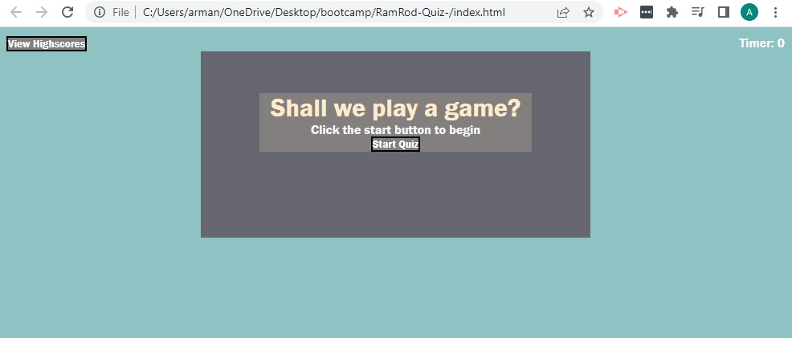

# RamRod-Quiz

## Description

Provide a short description explaining the what, why, and how of your project. Use the following questions as a guide:

I have created a Quiz consisting of an ineractive multiple-choice questions and answers.

This application will demonstrate the skills from this module, I have built a timed coding quiz with multiple-choice questions. This app runs in the browser, and features dynamically updated HTML and CSS powered by JavaScript, and has a responsive user interface. 

# User Story

AS A coding boot camp student
I WANT to take a timed quiz on JavaScript fundamentals that stores high scores
SO THAT I can gauge my progress compared to my peers

## Acceptance Criteria
GIVEN I am taking a code quiz
WHEN I click the start button
THEN a timer starts and I am presented with a question
WHEN I answer a question
THEN I am presented with another question
WHEN I answer a question incorrectly
THEN time is subtracted from the clock
WHEN all questions are answered or the timer reaches 0
THEN the game is over
WHEN the game is over
THEN I can save my initials and score

## Snapshot

.

## Link

The link of the webpage is: https://ramrod79.github.io/RamRod-Quiz-/